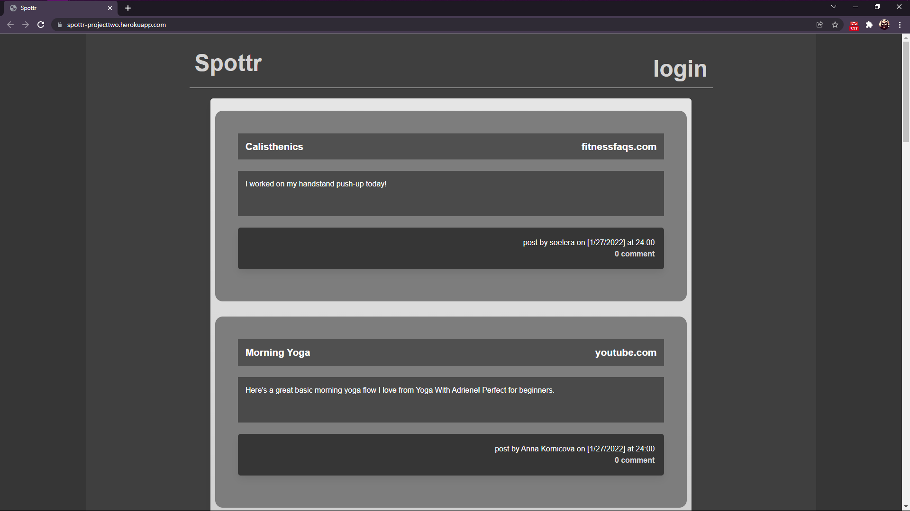
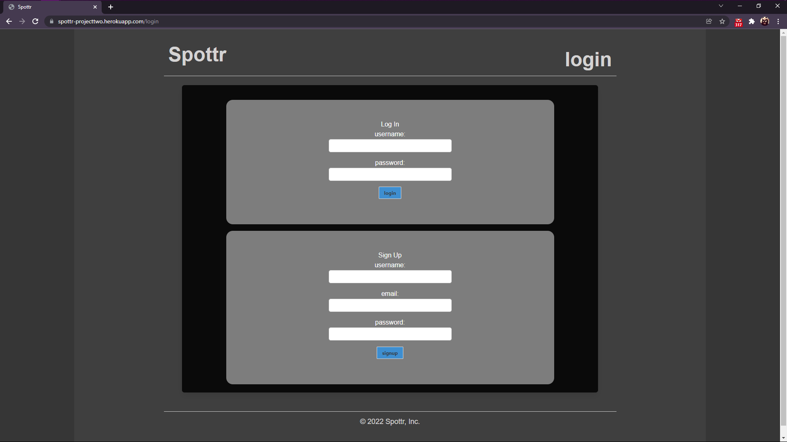
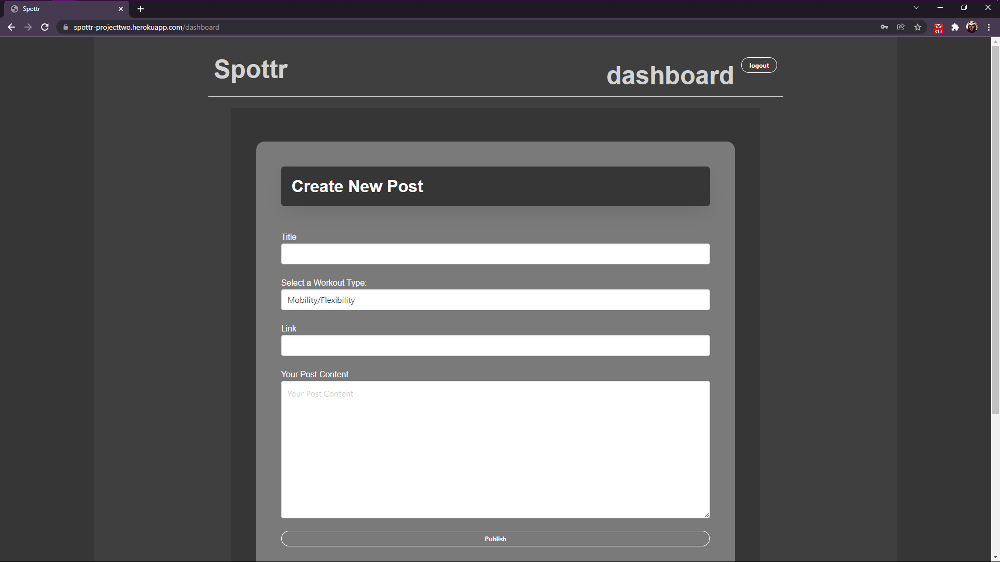
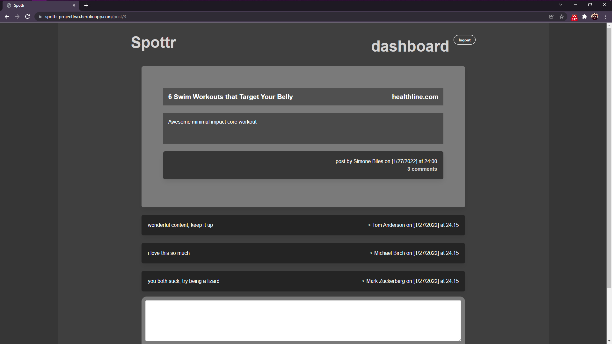

# Spottr

    
    
    
    

## Table of Contents

- [Description](#description)
- [Installation](#installation)
- [Usage](#usage)
- [Link](#link)
- [Contributing](#contributing)

## Description

Collaborative, full-stack blog site for Exercise Enthusiasts.

## Installation 

- `git clone` this repository locally. 
- Run `npm i` to install all dependencies.

## Usage 

When the application is installed, open the MySQL shell and input `source db/schema.sql` & `use spottr_db` then close shell. In the terminal input `npm run seed` (be sure to create a seed script in package.json) followed by `npm start` to initiate application. Launch a browser window and navigate to `localhost:{PORT}/`.  
Alternatively, a demo has been deployed to [Heroku](https://spottr-projecttwo.herokuapp.com/)

## Link 
[Heroku Demo](https://spottr-projecttwo.herokuapp.com/)  
[GitHub Repo](https://github.com/Rush0218/spottr)

## Contributing

Made by  
[Tre' Rush](https://github.com/Rush0218/)  
[Lexie Holder](https://github.com/LexieHolder)  
[Scott Howell](https://github.com/cyanidethejuggla)  
[Maxwell Bryn](https://github.com/ccffdead) 